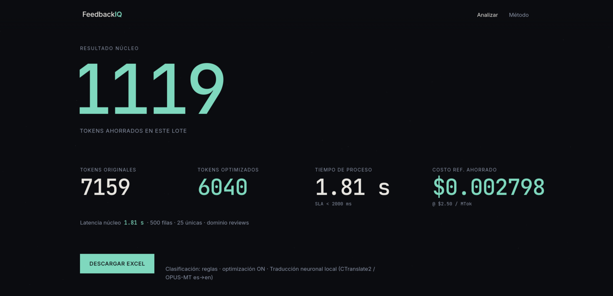
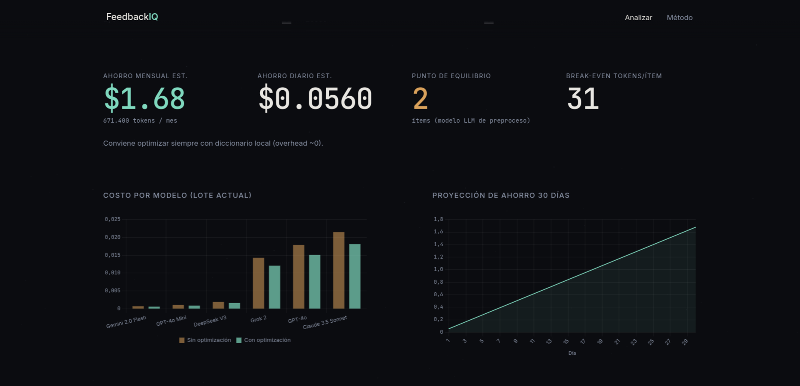
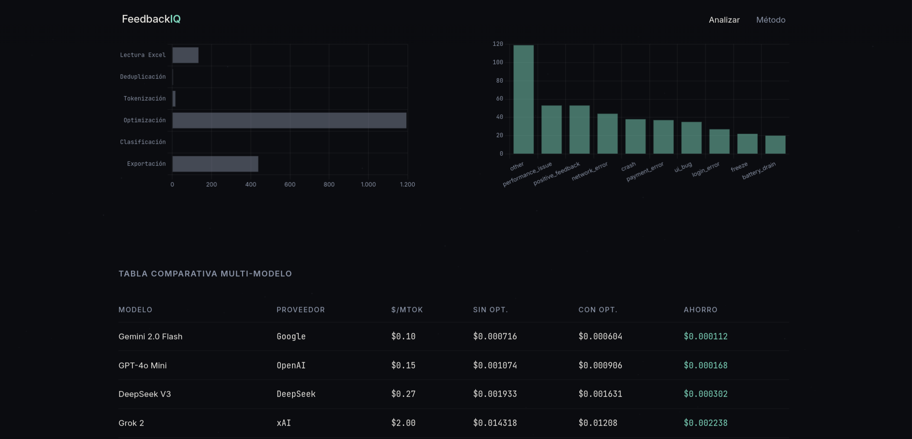

<p align="center">
  
</p>

<h1 align="center">FeedbackIQ</h1>

<p align="center">
  <strong>Ingesta Excel → tokens exactos → optimización ES→EN local → clasificación → export + analítica de ahorro</strong>
</p>

<p align="center">
  <a href="#características">Características</a> ·
  <a href="#capturas">Capturas</a> ·
  <a href="#inicio-rápido">Inicio rápido</a> ·
  <a href="#arquitectura">Arquitectura</a> ·
  <a href="#api">API</a> ·
  <a href="docs/ARCHITECTURE.md">Docs técnicas</a>
</p>

<p align="center">
  
  
  
  
  
  
</p>

---

## ¿Qué es?

**FeedbackIQ** mide y reduce el costo de procesar texto en español con modelos de IA.

Subes un Excel (reseñas, contratos, incidencias…). La app:

1. Detecta la columna de texto  
2. Cuenta tokens con **`tiktoken` / `o200k_base`** (no estimaciones por caracteres)  
3. Opcionalmente traduce **ES → EN de verdad** con un modelo neuronal **local** (CTranslate2 + OPUS-MT int8, sin API de pago)  
4. Clasifica cada fila en JSON estructurado (reglas por dominio)  
5. Exporta Excel limpio y muestra **ahorro en USD**, proyección a 30 días y comparativa multi-modelo  

> SLA de diseño del **resultado núcleo** (lotes normales): **&lt; 2 s** desde que el archivo llega al backend hasta tokens + tiempo + link de descarga.

---

## Características

| Área | Implementación |
|------|----------------|
| **Ingesta** | 1 archivo o lote de `.xlsx`; detección de columna; filtra basura; streaming en archivos grandes |
| **Tokens** | Conteo exacto `o200k_base` |
| **Optimización** | CT2 OPUS-MT es→en (int8, CPU); diccionario solo como fallback / referencia histórica |
| **Clasificación** | Dominios `reviews` · `contracts` · `incidents` (cambia columnas del Excel, no el motor de tokens) |
| **Export** | Excel válido (openpyxl) listo para Sheets / Excel |
| **Analítica** | KPI, multi-modelo, proyección 30d, break-even, latencia por etapa |
| **Reportes (n8n)** | Footer UI → `POST /api/report` → clasificación por reglas → webhook n8n (Sheets + Email + Telegram si es crítico); modo `N8N_DRY_RUN` sin n8n |
| **Estabilidad** | Pool de hilos, jobs async &gt; 3 000 filas, tope 50 000, `gc` post-lote, timeout en cliente |

---

## Capturas

### Resultado núcleo

KPI hero con tokens ahorrados, métricas de latencia y descarga de Excel. Motor: **CTranslate2 / OPUS-MT es→en**.

<p align="center">
  
</p>

### Analítica extendida

Ahorro mensual estimado, punto de equilibrio, costo por modelo y proyección a 30 días.

<p align="center">
  
</p>

### Pipeline y modelos

Latencia por etapa, distribución de tipos clasificados y tabla multi-modelo (sin opt. vs con opt.).

<p align="center">
  
</p>

---

## Inicio rápido

### Requisitos

- Python **3.11+**
- Node.js **18+**
- ~300 MB para el modelo de traducción (primera vez)

### Instalar

```bash
git clone https://github.com/7Freeza/feedbackiq-app.git
cd feedbackiq-app
npm install
npm run setup
```

### Modelo de traducción (una vez)

```bash
cd backend
.venv/bin/python - <<'PY'
from pathlib import Path
from huggingface_hub import snapshot_download
dest = Path("models/opus-mt-es-en-ct2")
if not (dest / "model.bin").exists():
    snapshot_download(repo_id="gaudi/opus-mt-es-en-ctranslate2", local_dir=str(dest))
print("OK", dest)
PY
cd ..
```

### Ejecutar

```bash
npm run dev
```

| Servicio | URL |
|----------|-----|
| **Interfaz** | [http://localhost:5173](http://localhost:5173) |
| **API** | [http://127.0.0.1:4004](http://127.0.0.1:4004) |
| **OpenAPI** | [http://127.0.0.1:4004/docs](http://127.0.0.1:4004/docs) |

Samples: `samples/reviews_sample.xlsx`, `samples/contracts_sample.xlsx`.

Guía completa: **[docs/SETUP.md](docs/SETUP.md)**.

---

## Arquitectura

```
Excel ──► ingest ──► dedup ──► tokenize (o200k)
                      │
         optimize? ───┼──► CTranslate2 ES→EN (local)
                      │
                      ▼
              classify (rules) ──► export XLSX
                      │
                      └──► analytics (multi-model · 30d · break-even)

UI footer ──► POST /api/report ──► classify (rules) ──► n8n webhook
                                                      ├── Google Sheets
                                                      ├── Email (auto-reply)
                                                      └── Telegram (severidad crítica)
```

| Capa | Stack |
|------|--------|
| Frontend | Vanilla JS, Vite 6, Chart.js — diseño **Vacío numérico** + formulario de reportes |
| Backend | FastAPI, uvicorn, thread pool + jobs async, `httpx` → n8n |
| Tokens | tiktoken `o200k_base` |
| Traducción | CTranslate2 + OPUS-MT es→en int8 |
| Excel | pandas / openpyxl (`read_only` en archivos grandes) |
| Automatización | n8n (webhook, Code nodes, Sheets, Email, Telegram opcional) |

Detalle: **[docs/ARCHITECTURE.md](docs/ARCHITECTURE.md)**.

### Dominios (clasificación)

El selector de dominio **no cambia** el conteo ni la traducción. Solo el esquema de clasificación y las columnas del Excel exportado:

| Dominio | Ejemplo de campos |
|---------|-------------------|
| `reviews` | `error_type`, `component`, `severity`, `sentiment` |
| `contracts` | `clause_type`, `amount_hint`, `date_hint` |
| `incidents` | `incident_type`, `priority`, `department` |

---

## API

| Método | Ruta | Descripción |
|--------|------|-------------|
| `GET` | `/api/health` | Salud |
| `GET` | `/api/engine` | Motor CT2 + límites |
| `GET` | `/api/domains` | Presets de dominio |
| `GET` | `/api/models` | Precios multi-modelo |
| `POST` | `/api/analyze` | Pipeline (sync o **202** job) |
| `GET` | `/api/jobs/{id}` | Estado de job grande |
| `POST` | `/api/analytics/recalculate` | Recalcular proyecciones |
| `GET` | `/api/download/{file}` | Excel de salida |
| `POST` | `/api/report` | Reporte de problema → n8n |
| `GET` | `/api/report/status` | Canal n8n configurado (sin secretos) |

Referencia completa: **[docs/API.md](docs/API.md)**.

```bash
curl -s -X POST http://127.0.0.1:4004/api/analyze \
  -F "files=@samples/reviews_sample.xlsx" \
  -F "optimize_tokens=true" \
  -F "domain=reviews" | jq '.core'
```

---

## Estructura del repositorio

```text
FeedBackIQ/
├── backend/
│   ├── app/
│   │   ├── api/          # Rutas HTTP
│   │   ├── core/         # Pipeline, CT2, Excel, jobs, analytics, report→n8n
│   │   └── domains/      # Reglas reviews / contracts / incidents
│   ├── models/           # CT2 weights (no versionados)
│   ├── requirements.txt
│   └── run.py
├── frontend/
│   ├── css/              # Vacío numérico + UI de reportes
│   ├── js/               # Router, API client, charts, report-form
│   └── vite.config.js    # Proxy /api → :4004
├── docs/
│   ├── images/           # Capturas del README
│   ├── n8n/              # Code nodes + plantillas email del workflow
│   ├── N8N_REPORTES.md   # Guía webhook Sheets/Email/Telegram
│   ├── ARCHITECTURE.md
│   ├── API.md
│   └── SETUP.md
├── samples/              # Excel de prueba
├── exports/              # Salidas generadas (gitignored)
└── package.json          # concurrently: frontend + backend
```

---

## UI — Vacío numérico

| Token | Valor |
|-------|--------|
| Fondo | `#0B0C10` |
| Texto | `#E8E6E1` |
| Ahorro | `#7FD8BE` |
| Alerta | `#D9A15B` |
| Datos | JetBrains Mono (tabular) |

Sin glassmorphism, sin bordes decorativos: el espacio estructura la interfaz.

---

## Límites por defecto

| Parámetro | Valor |
|-----------|------:|
| Upload máx. | 80 MB |
| Sync hasta | 3 000 filas |
| Tope absoluto | 50 000 filas |
| Chunk pipeline | 500 |
| Workers pesados | 2 |

---

## Reportes de problemas (n8n)

Canal de feedback integrado en el producto: el footer **¿Encontraste un problema?** envía el mensaje al backend, se **clasifica por reglas** (severidad + módulo; misma lógica en Python y en el nodo Code de n8n) y se reenvía a un **webhook de n8n**.

| Paso | Qué hace |
|------|----------|
| 1. UI | Formulario en footer (mensaje + email opcional) |
| 2. Backend | `POST /api/report` → `report_rules` + `report_service` (httpx) |
| 3. n8n | Webhook → clasificación → **Google Sheets** + **Email** |
| 4. Críticos | Rama extra a **Telegram** cuando la severidad es crítica |
| 5. Sin n8n | `N8N_DRY_RUN=true` en `backend/.env` para probar el formulario en local |

**Config (ver `backend/.env.example`):**

```env
N8N_WEBHOOK_URL=http://localhost:5678/webhook/feedbackiq-report
N8N_WEBHOOK_SECRET=
N8N_WEBHOOK_HEADER_NAME=X-FeedbackIQ-Secret
N8N_DRY_RUN=false
```

| Recurso | Ruta |
|---------|------|
| Guía paso a paso | **[docs/N8N_REPORTES.md](docs/N8N_REPORTES.md)** |
| Code: clasificación | `docs/n8n/code-clasificacion.js` |
| Code: parse Ollama (opcional) | `docs/n8n/code-parse-ollama.js` |
| Code: respuesta automática | `docs/n8n/code-respuesta-auto.js` |
| Plantillas email | `docs/n8n/email-template-*.html` |

---

## Documentación

| Documento | Contenido |
|-----------|-----------|
| [docs/SETUP.md](docs/SETUP.md) | Instalación, modelo, puertos |
| [docs/ARCHITECTURE.md](docs/ARCHITECTURE.md) | Diseño del sistema |
| [docs/API.md](docs/API.md) | Contrato HTTP |
| [docs/N8N_REPORTES.md](docs/N8N_REPORTES.md) | Automatización de reportes con n8n |

---

## Licencia

[MIT](LICENSE) — uso libre con atribución del aviso de licencia.

---

<p align="center">
  <sub>FeedbackIQ · precisión de tokens · traducción local · analítica de ahorro · reportes n8n</sub>
</p>

